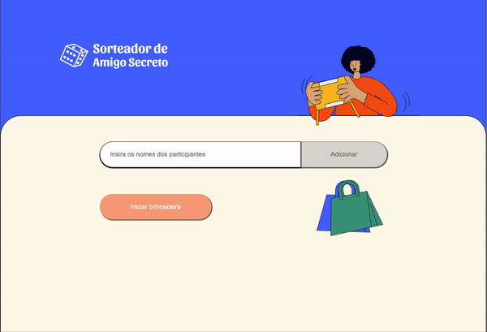

<h1 align="center">Sorteador de Amigo Secreto 🗓️</h1>

<div align="center">
    
</div>

## 📚 Sobre

O **Sorteador de Amigo Secreto** é uma aplicação que permite que você brinque com seus amigos, criando uma listagem e sorteando seu amigo secreto de forma aleatória.

O foco deste projeto foi realizar os testes TDDs antes da criação dos componentes.


## 🚀 Tecnologias Utilizadas
- Recoil
- ReactJS
- Typescript
- Jest
- CSS

## ⏱️ Iniciar projeto

```bash
# Clone o repositório:
http://github.com/polyanetuag/sorteador-de-amigo-secreto-main.git

# Instale as dependências
$ yarn install

# Execute o servidor de desenvolvimento:
$ yarn start

# Execute os testes:
$ yarn test

```

## 📋 Licença
Esse projeto está sob a licença MIT. 

---

Desenvolvido com 💜 por Polyane Tuag
