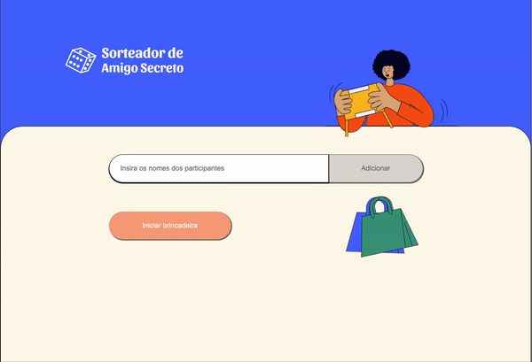

<h1 align="center">Sorteador de Amigo Secreto</h1>

<div align="center">
    
</div>

## 📚 Sobre

O **Sorteador de Amigo Secreto** é uma aplicação que permite que você crie uma lista para jogar amigo secreto, sendo o sorteio realizado de forma aleatória.

O foco deste projeto foi realizar os testes TDD's antes da criação de cada componente.


## 🚀 Tecnologias Utilizadas
- [Recoil](https://recoiljs.org/)
- [ReactJS](https://react.dev/)
- [Typescript](https://www.typescriptlang.org/)
- [Jest](https://jestjs.io/docs/tutorial-react)
- [CSS](https://developer.mozilla.org/pt-BR/docs/Web/CSS)

## ⏱️ Iniciar projeto

```bash
# Clone o repositório:
http://github.com/polyanetuag/sorteador-de-amigo-secreto-main.git

# Instale as dependências
$ yarn install

# Execute o servidor de desenvolvimento:
$ yarn start

# Execute os testes:
$ yarn test

```

## 📋 Licença
Esse projeto está sob a licença [MIT](https://opensource.org/license/mit). 

---

Desenvolvido com 💜 por Polyane Tuag
